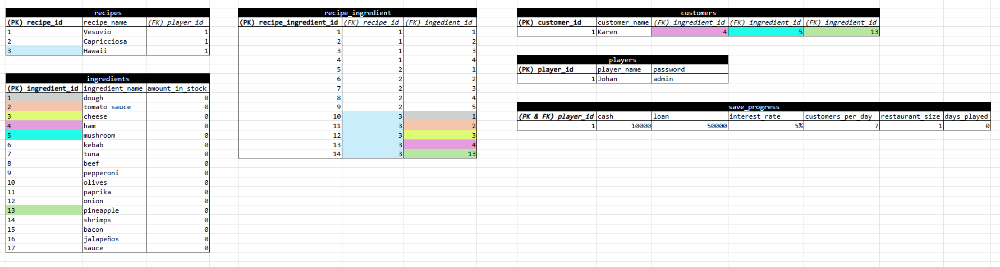

# Changelog / Dev Diary

> So, I started on the Java side of thing. I struggled at first with creating the connection to the db, 
> but I think that I must have taken a wrong turn somewhere in the Baeldung guides. When I backed away, and tried from scratch,  
> using only the tools/syntax/classes that I understood at least on surface level it worked out fine.

> That included:
> - DriverManager.getConnection
> - PreparedStatement
> - Statement
> - ResultSet
> - Regex-line-split

> When I had the connection, and had created my very cool scriptrunner-method, 
> I knew that I then had the means to build using whole scripts.

> That was when the real challenge started. I juggled with ideas for a simple Content Management Service, 
> a Gym Session and Calorie Calculator app, and this Pizza thing, and made drafts for them to try them out.

> After maybe 20 hours of internal battle, I decided to stick with this, and then to fix whatever problems it has.
> So now, at the time of writing my first entry here, I think the basic structure is almost finished. Right now it looks like this.

    Not sure everything is 100% correlated, or that I will keep naming, or if there is spelling errors, 
    but that is not a concern at this part of the process. Same goes for all things forward until I signal completion.

> But, the thing that got me to write this first entry was the realization that 
> I do need to break out `dough`, `tomato sauce` and `cheese` out of ingredients, 
> since I will randomize each customer's `desired_ingredient` and I would like to be able to do that with the complete set of ingredient.
> Also, all pizzas will contain `dough`, `tomato sauce` and `cheese`.

> So, my plan is to break have `prepared_ingredients` (maybe toppings is a better name, then?) and `basic_ingredients`.

    Until next time:
    - Fix ingredients as described above.
    - Create the .sql-script to create the tables.
    - Learn how to create a web app without Spring, Jpa.
    - Can I use Thymeleaf anyway?
    - Set up home page.
    - *Risky* - Further plans about 'raw-ingredients' like flour, yeast, olive oil, tomatoes, basil, garlic, and the upgrades connected to them.

## Entry #2

> So a lot has happened since last post. Good and bad. I decided that it was too complex for me to try and create it as a web app.
> So console application it is! I have kind of created the Login Service. It will need heavy refactoring, but it mostly works.
> Now I can go on with either (1) refactoring now, which is probably for the best to avoid later spaghetti.
> or (2) start on writing what happens in each "section" like rules, office-stat-view, buying stock, prepare basic ingredients, serving customers and the recipe-creation.

ENTRY 3

Något om att i detta projektet har jag börjat lära mig och/eller ifrågasätta att andra arbetsmetoder. Som att varför behöver jag ett id, när jag ändå hämtar per username, samt arkitektur och så vidare.

- Skapa DAO
- Hasha passwords
- refaktorera statics?
- flytta CRUD till repo-layer?
- 